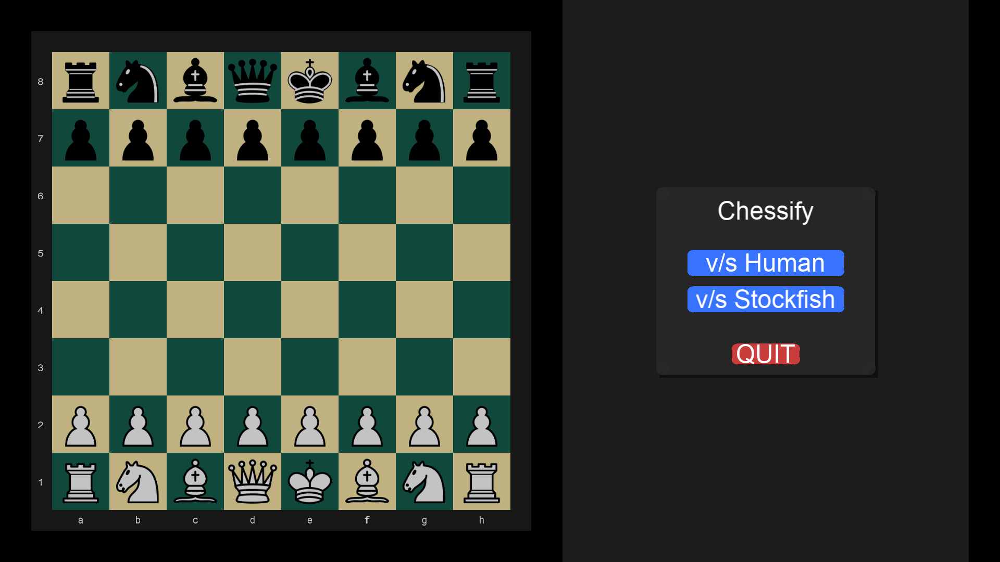
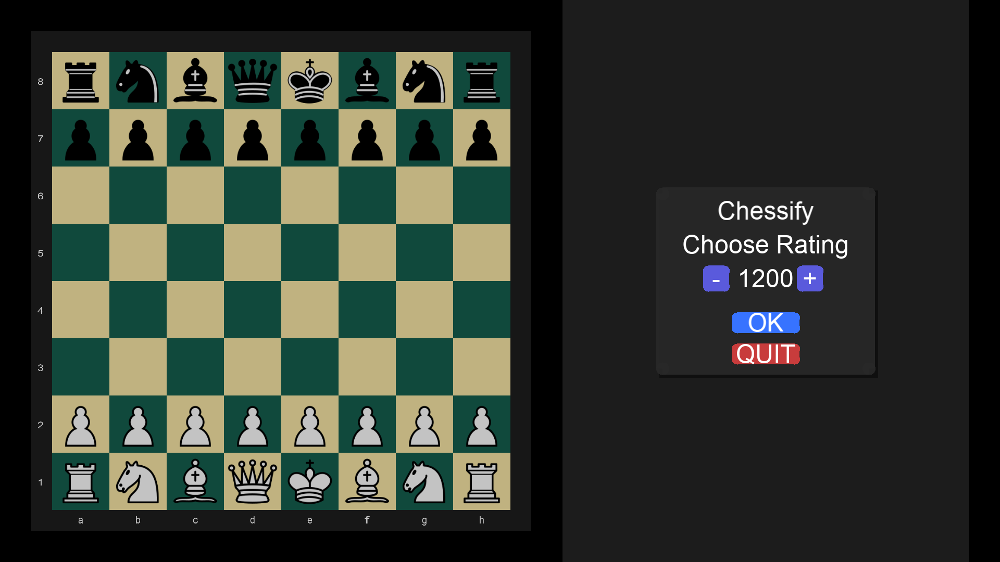
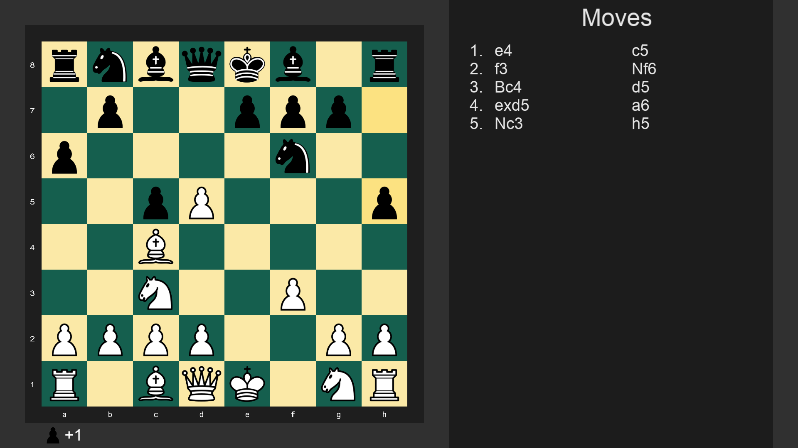
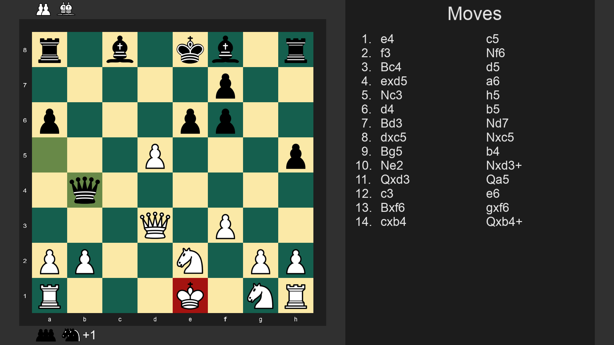
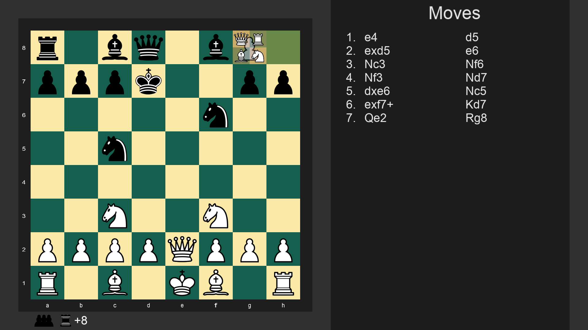
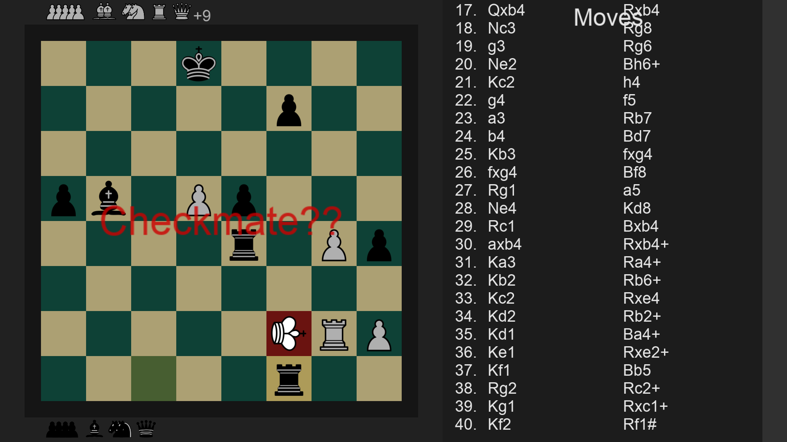
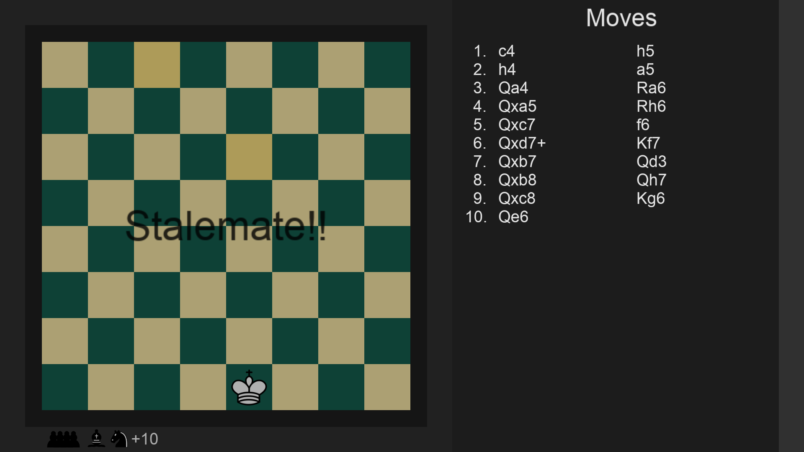
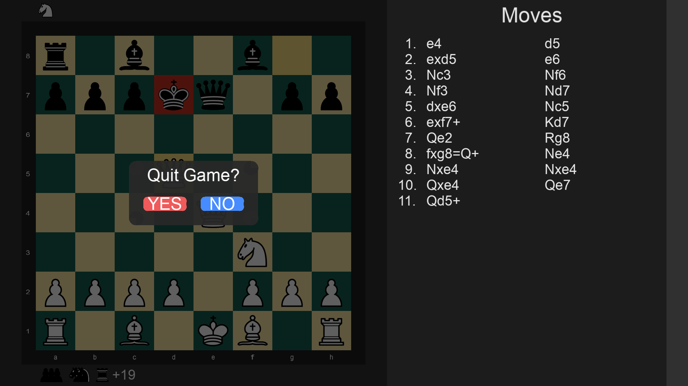

# ♟️ Chessify

### C++ Chess Application with SDL3 GUI and Stockfish AI

Chessify is a desktop chess application written in **modern C++ using object-oriented design** featuring a custom chess rule engine, an SDL3-based graphical interface, and AI gameplay powered by **Stockfish** via the **UCI protocol**.

The project implements chess logic, move validation, UI states, and engine communication **from scratch without using external chess libraries**.

---

# Screenshots

### Start Menu



### Choose Rating



### Gameplay



### Legal Move Highlighting



### Pawn Promotion



### Checkmate



### Stalemate



### Exit Confirmation



---

# Features

### Gameplay

- Complete chess rules implementation
- Player vs Player mode
- Player vs Stockfish (Chess Engine) mode
- Adjustable AI difficulty (Choose Engine Rating)
- Check, checkmate, and stalemate detection

### Move System

- Legal move generation for all pieces
- Highlighting of King in Check
- Last move highlighting
- Illegal move prevention
- Move history tracking
- Undo / redo state functionality

### Special Rules

- Castling (king-side and queen-side)
- En-passant capture
- Pawn promotion with piece selection (Q, R, B, N)

### UI

- SDL3 graphical interface
- Start menu with mode selection
- Engine ELO selection
- Exit confirmation dialog
- Implementation of Moves list
- Overlay dialogs

### Captured Pieces

- Captured pieces and difference tracking
- Stacked captured piece display
- Separate tracking for both sides

---

# Stockfish Integration

Stockfish is integrated using the **UCI (Universal Chess Interface)** protocol.

Workflow:

1. Launch Stockfish process
2. Send current board position
3. Request best move (`setoption name UCI_Elo value [ELO_RATING]`)
4. Parse engine response
5. Execute move live on board

Example UCI commands:

```
uci
isready
position startpos moves e2e4 e7e5
setoption name UCI_LimitStrength value true
setoption name UCI_Elo value 1500
bestmove g8f6(q)
```

The engine currently plays **Black**, while the player controls **White**.

---

# Game States

The application uses a simple state machine:

```
START_MENU
PLAYING
EXIT_CONFIRM
```

ESC opens the exit confirmation dialog from any state.

---

# Project Structure

```
src/

Board/
    Game state
    Move validation
    Chess rule enforcement

Piece/
    Piece behavior
    Rendering logic

Move/
    Move representation

MoveRecord/
    Move history and undo/redo

Engine/
    Stockfish communication (UCI)

Settings/
    Game configuration

main.cpp
    SDL initialization
    Event loop
    UI state handling
```

---

# Technologies Used

| Technology   | Purpose              |
| ------------ | -------------------- |
| C++          | Core application     |
| SDL3         | Graphics rendering   |
| SDL3_ttf     | Font rendering       |
| Stockfish    | Chess Engine         |
| UCI Protocol | Engine communication |
| CMake        | Configuration System |

---

# Author

**Divyansh Sharma**

---

# Project Highlights

This project demonstrates:

- Full chess rule implementation
- Object-oriented C++ design
- GUI programming with SDL3
- External engine integration using UCI
- Deterministic game state management
