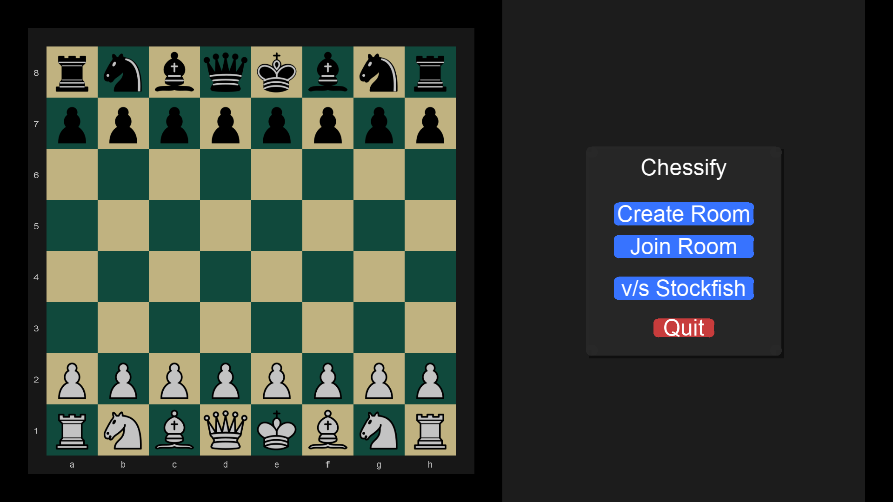
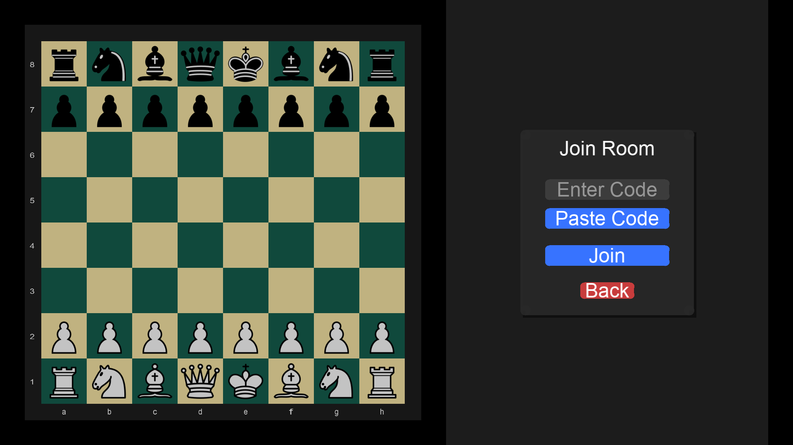
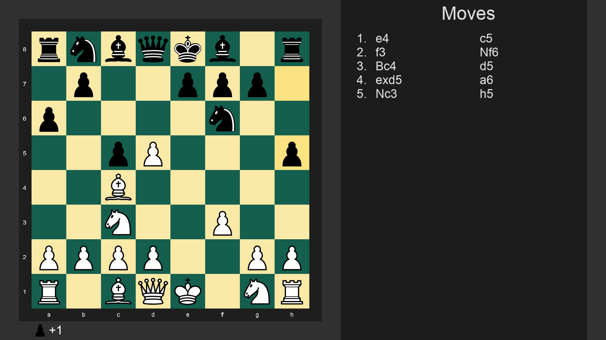
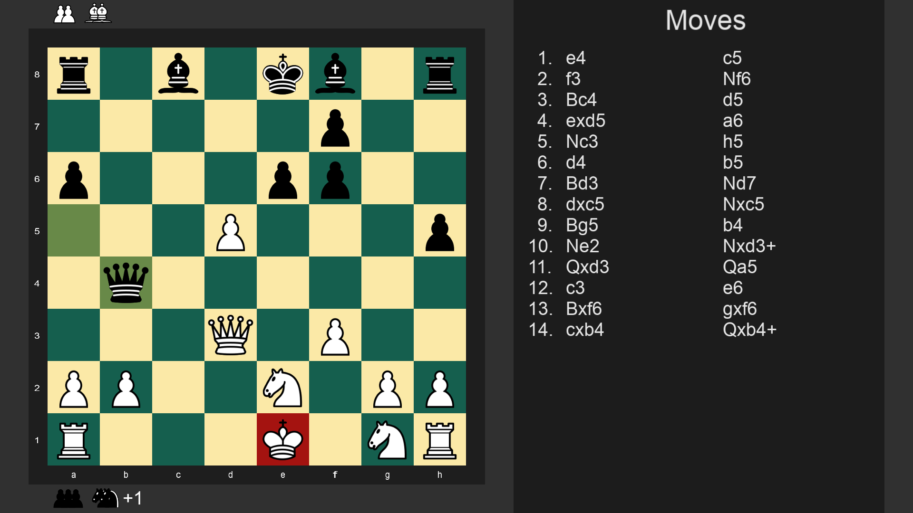
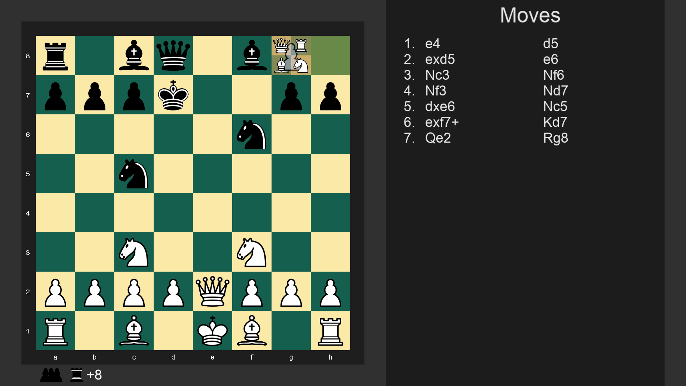
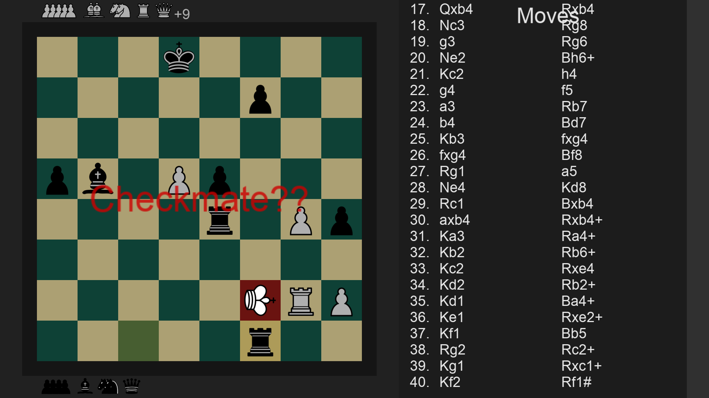
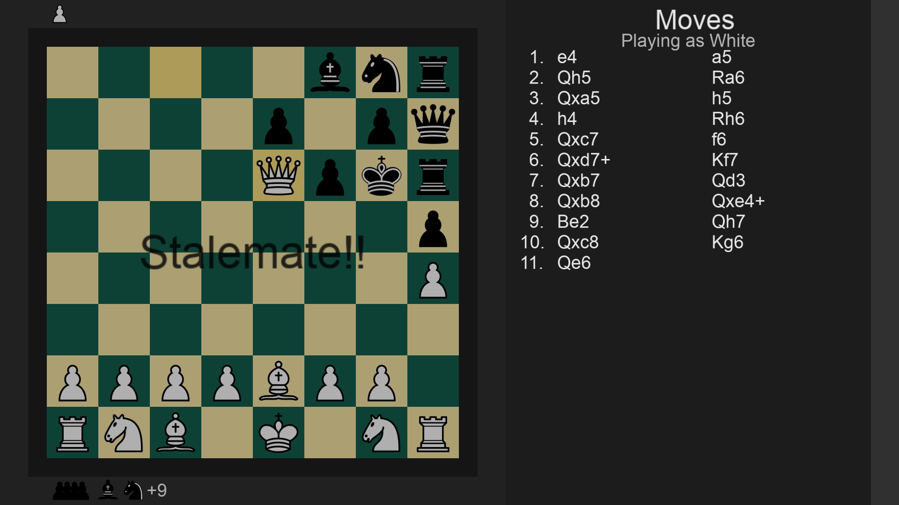
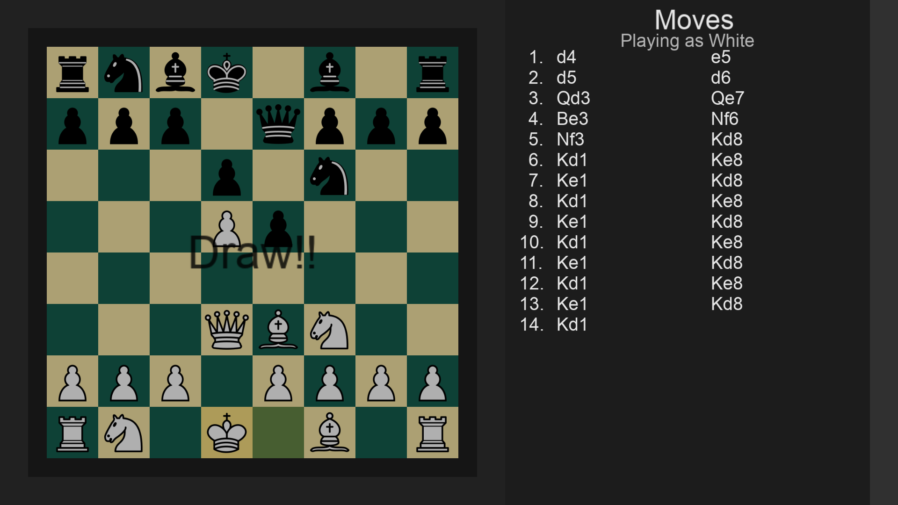
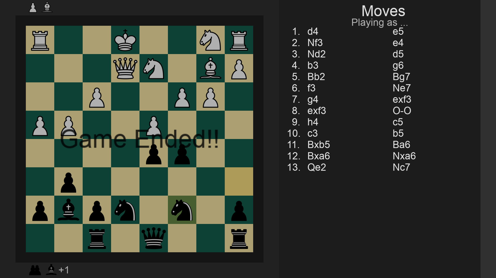
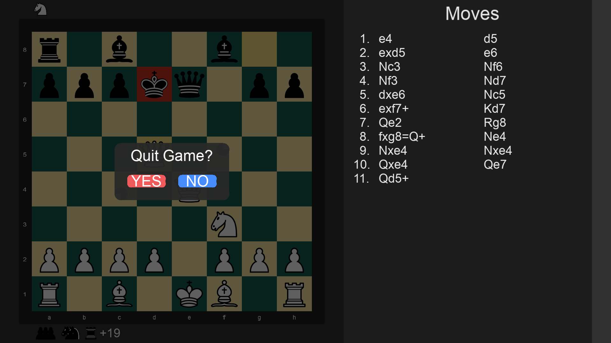

# ♟️ Chessify

### Modern C++ Chess Application with SDL3, Stockfish AI & Real-Time Multiplayer

Chessify is a desktop chess application built in **C++17** with a custom chess rules engine, an **SDL3** graphical interface, **Stockfish** integration through the **UCI protocol**, and a real-time multiplayer system built with **Boost.Asio/Boost.Beast WebSockets**.

The chess engine and game-state management are implemented from scratch without using an external chess library.

---

## Screenshots

### Start Menu



### Stockfish - Difficulty & Player Color


### Create Room


### Join Room



### Gameplay



### Legal Move Highlighting



### Pawn Promotion



### Checkmate



### Stalemate



### Draw



### Multiplayer - Game Ended



### Exit Confirmation



---

# Features

## ♟️ Chess Engine

- Complete chess rule implementation
- Legal move generation for all pieces
- Check, checkmate, and stalemate detection
- Illegal move prevention
- King-safety validation
- Board-state simulation for move validation
- Move history and state reconstruction

## Special Moves

- King-side and queen-side castling
- En-passant capture
- Pawn promotion to Queen, Rook, Bishop, or Knight

## Draw Detection

- Insufficient material
- 75-move rule
- Fivefold repetition
- Stalemate

Draw positions preserve the complete board state so both kings and all remaining pieces remain visible.

---

# 🎮 Game Modes

### Player vs Player

Local two-player chess using the same desktop application.

### Player vs Stockfish

- Configurable engine strength
- White, Black, or Random player color
- Automatic board perspective based on player color
- Engine-first gameplay when the player chooses Black
- Stockfish communication through UCI

### Real-Time Multiplayer

- Room-code matchmaking
- Create Room / Join Room
- Two-player room management
- Randomized White/Black assignment
- Server-side turn synchronization
- Remote move forwarding
- Room isolation
- Player disconnect handling
- `Game Ended!!` overlay when an opponent disconnects

---

# 🌐 Multiplayer Architecture

```text
+-------------------+       WebSocket       +----------------------+
|  Chessify Client  | <-------------------> |   Chessify Server    |
|                   |                       |                      |
|  SDL3 UI          |                       |  RoomManager         |
|  Board            |                       |  GameRoom            |
|  GameController   |                       |  Player Sessions     |
|  NetworkClient    |                       |  Message Routing     |
+-------------------+                       +----------------------+
```

The server manages independent game rooms and forwards messages between the two players in each room.

The client maintains the local chess state and renders the synchronized game through the SDL3 interface.

---

# 📡 Networking

Networking uses:

- **Boost.Asio** for networking primitives
- **Boost.Beast** for WebSocket communication
- Multithreaded message handling
- Thread-safe room state
- Thread-safe message forwarding

Application-level messages include:

```text
CREATE_ROOM
JOIN_ROOM
START
MOVE
DISCONNECT
ROOM_FULL
```

These messages coordinate room creation, joining, player assignment, game initialization, move synchronization, and connection lifecycle events.

---

# 🤖 Stockfish Integration

Stockfish is integrated through the **Universal Chess Interface (UCI)**.

Workflow:

1. Launch the Stockfish process
2. Initialize UCI
3. Configure engine strength
4. Send the current board position
5. Request the best move
6. Parse the returned UCI move
7. Apply the move to the board

Example:

```text
uci
isready
setoption name UCI_LimitStrength value true
setoption name UCI_Elo value 1500
position startpos moves e2e4 e7e5
go depth 18
```

Stockfish can play either White or Black depending on the selected player color.

---

# 🧩 Move System

Chessify maintains structured move history supporting:

- Move records
- Algebraic move display
- Captured-piece tracking
- Last-move highlighting
- Undo / redo
- Historical board reconstruction
- Replay navigation

---

# ♜ Captured Pieces & Material

Captured pieces are tracked independently for White and Black.

The UI supports:

- Captured-piece display
- Stacked captured pieces
- Material difference calculation
- Perspective-aware captured-piece positioning

Captured-piece rows and the material indicator flip consistently with the active board perspective.

---

# 🖥️ User Interface

Implemented with **SDL3** and **SDL3_ttf**.

Includes:

- Start menu
- Stockfish configuration
- Create Room
- Join Room
- Waiting Room
- Gameplay screen
- Move history panel
- Promotion menu
- Exit confirmation
- Checkmate overlay
- Stalemate overlay
- Draw overlay
- Multiplayer game-ended overlay

Keyboard navigation supports common actions such as confirming and going back.

---

# 🔄 Board Perspective

The board dynamically changes orientation based on the player's color.

- **White perspective:** `a` → `h`, ranks `8` → `1`
- **Black perspective:** `h` → `a`, ranks `1` → `8`

The board coordinates, pieces, captured-piece rows, and material indicator remain consistent with the active perspective.

---

# 🏁 Game States

The application uses UI/game-state handling for:

```text
START_MENU
CREATE_ROOM
JOIN_ROOM
WAITING_ROOM
PLAYING
EXIT_CONFIRM
```

Gameplay terminal states include:

```text
CHECKMATE
STALEMATE
DRAW
CONNECTION_GAME_OVER
```

The board remains visible while the appropriate end-game overlay is displayed.

---

# 📁 Project Structure

```text
Chessify/
│
├── src/
│   ├── Board/          # Game state and chess rules
│   ├── Piece/          # Piece representation and behavior
│   ├── Move/           # Move representation
│   ├── MoveRecord/     # Move history and replay
│   ├── Engine/         # Stockfish / UCI integration
│   ├── Network/        # WebSocket client
│   ├── Server/         # RoomManager / GameRoom
│   ├── Settings/       # Game configuration
│   └── main.cpp        # SDL, UI states and main loop
│
├── assets/
├── screenshots/
├── CMakeLists.txt
└── README.md
```

---

# 🛠️ Technologies Used

| Technology      | Purpose                         |
| --------------- | ------------------------------- |
| **C++17**       | Core application and game logic |
| **SDL3**        | Graphics, windowing and input   |
| **SDL3_ttf**    | Font rendering                  |
| **Boost.Asio**  | Networking                      |
| **Boost.Beast** | WebSocket communication         |
| **Stockfish**   | Chess engine                    |
| **UCI**         | Engine communication            |
| **CMake**       | Build configuration             |
| **WebSockets**  | Real-time multiplayer           |

---

# 🏗️ Build

Chessify uses **CMake**.

```bash
mkdir build
cd build
cmake ..
cmake --build .
```

The client requires the application's runtime assets and Stockfish executable at the expected paths.

For multiplayer, the desktop client connects to the deployed Chessify WebSocket backend.

---

# ✨ Project Highlights

- Custom chess rules engine implemented from scratch
- Complete special-move handling
- Automatic draw detection
- Move-history reconstruction with undo/redo
- Stockfish integration through UCI
- SDL3 real-time graphical rendering
- Multithreaded WebSocket networking
- Thread-safe multiplayer room management
- Real-time move synchronization
- Player lifecycle and disconnect handling
- Perspective-aware board and captured-piece rendering
- Modular separation of game logic, UI, networking, and engine communication

---

# 👤 Author

**Divyansh Sharma**
